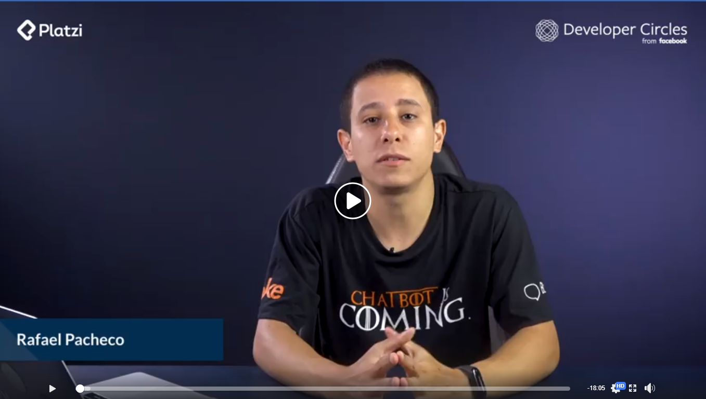
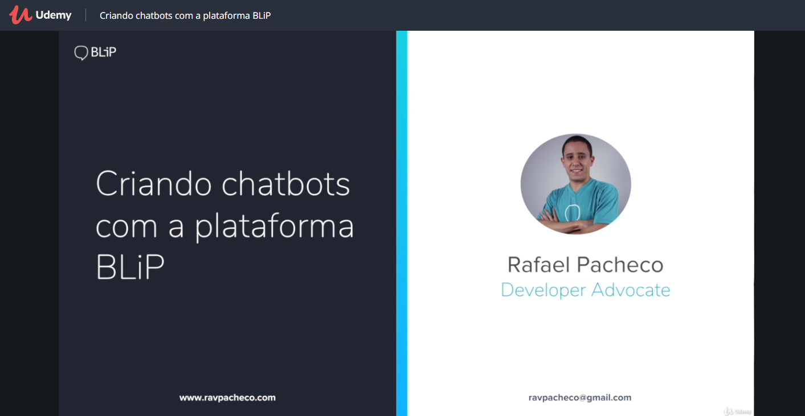
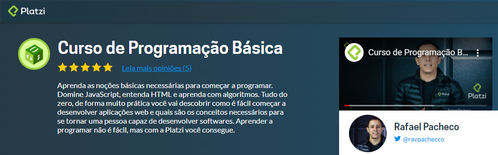
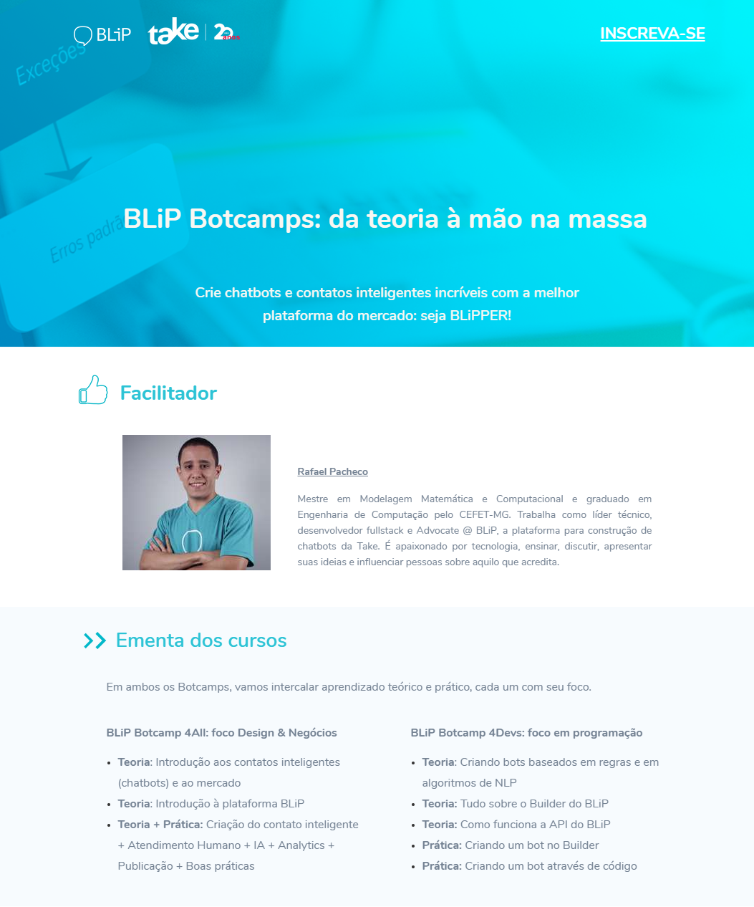

## Cursos online
-----------------------------

* **[GRATUITO]** [Curso de Chatbots com Facebook Messenger](https://www.facebook.com/groups/DevCSaoPaulo/learning_content/?filter=489591444944808) - Curso prático sobre como criar chatbots para o Facebook Messenger (Platzi e Facebook, Colômbia)

<!--  -->

* **[GRATUITO]** [Criando chatbots com a plataforma BLiP](https://www.udemy.com/course/criando-chatbots-com-a-plataforma-blip/) - Curso prático sobre como criar chatbots para a plataforma BLiP (Take, Brasil)

* [Programação Básica](https://platzi.com.br/cursos/programacao-basica/) - Curso sobre conceitos de programação web utilizando Javascript, HTML e CSS (Platzi, Colômbia)

## Cursos presenciais
-----------------------------

* [BLiP Botcamp](https://botcamp.blip.ai) - BLiP Botcamp (Chatbots da teoria a prática)

Ficou com alguma dúvida? Me envie me uma mensagem 😉👇.